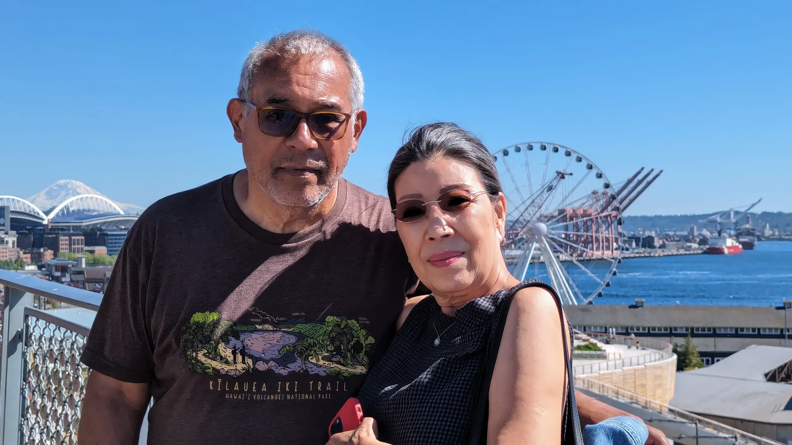

## Day 1: Chicago to Minnesota

**June 3, 2024**

### States traveled through so far

1. Illinois **NEW**
2. Wisconsin **NEW**
3. Minnesota **NEW**

*Route day 1 from Chicago to North Dakota.*

**Depart Chicago @ 3:05pm**

I'm back on the Amtrak and I couldn't be happier!

It's been almost three years since I've done a long-distance Amtrak ride. My first route, in 2021, was from Chicago to Seattle, with stops in Minneapolis/St. Paul and Glacier National Park.

But this trip is not that.

This time, I am going non-stop to Seattle from Chicago.

It is a 47-hour trip that is basically non-stop except for the occasional passenger pickup/drop-off and refueling.

Not only am I going non-stop to Seattle, but I am also traveling with my dad in a roomette. This means that we can actually lie down to get some sleep, eat proper meals, and have some level of privacy compared to the regular coach seats.

I've done overnight coach before, and it's not something I would do again if I didn't have to. We are barely 5 hours in and I can already tell what an upgrade having our private space is.

---

**Dinner: 7:30pm**

For dinner, my dad and I are paired with two random people. One of them seems to be an Amtrak veteran.

His advice:

- Expect delays — long delays.
- Order french toast for breakfast and the flat iron steak for dinner.
- Listen to the observation talks.

**Dinner menu**

- Spring salad
- Flat iron steak
- Cheesecake
- White wine

---

**9:30pm — 6 hours in**

It's pitch black now. I'm in the observation car. It's quiet. Magical.

Time in motion is something else. Whether flying or cruising at 79 mph, hours fill themselves with thought — and I think that’s a good thing.

Goodnight for now. I’ll write back tomorrow 👋

---

## Day 2: Minnesota to Montana

**June 4, 2024**

### States traveled through so far

1. Illinois
2. Wisconsin
3. Minnesota
4. North Dakota **NEW**
5. Montana **NEW**

---

**1:13pm**

After falling asleep around 2am, I got about five and a half hours of decent sleep.

**Breakfast**

- Coffee and orange juice
- French toast with maple syrup and strawberries
- Sausage links

The dining car food is miles ahead of the snack bar.

---

**10am — Minot break**

A half-hour stretch, smoke, and refuel stop. I went for a short run and grabbed coffee from a trailer shop near the platform.

Fresh air makes all the difference.

---

**6:03pm — Montana**

The mountains are upon us.

We cross from Central to Mountain Time, and Glacier National Park begins to reveal itself.

---

**7pm — Dinner & delays**

Tornadoes. Signal malfunctions. High winds. We’re now 3.5 hours behind schedule.

The train stops.
The lights go out.

> “Well, that’s not good.”

Eventually, the lights return. No answers yet.

---

**Train people**

Someone explains the idea of “train people” — people who make train travel their personality.

I kinda like that.

---

**9:34pm MT**

Still light outside. Racing the sun.

This is the home stretch.

---

## Day 3: Montana to Seattle

**June 5, 2024**

### States traveled through so far

1. Illinois
2. Wisconsin
3. Minnesota
4. North Dakota
5. Montana
6. Idaho **NEW**
7. Washington **NEW**

---

We finally arrive at King Street Station.

Sunny. 70s. Perfect.

### Thoughts on Amtrak’s Empire Builder

- Get a sleeper car if you can.
- Expect delays.
- Enjoy the journey.
- Talk to people.
- The shower is fine.
- The observation car is elite.

**Ratings**

- Sleeper car: ⭐⭐⭐½
- Coach seat: ⭐⭐½

---

## Day 4: Seattle

**June 6, 2024**

Today was quiet but meaningful.

I met a family member who spoke only Korean. We didn’t share words — but we didn’t need to.

Some connections exist beyond language.

*Dad and his late wife's sister in Seattle.*

---

## Day 5: Seattle

**June 7, 2024**

Pike Place Market. Crowded. Hot. Worth it.

Dinner at Din Tai Fung — dumplings on dumplings.

Fun fact:
[Pickleball was invented in Washington in 1965](https://en.wikipedia.org/wiki/Pickleball).

---

## Days 6–13: Cruise Days

**June 8–13, 2024**

Internet was limited, days blended together.

### Route

1. Seattle → Juneau
2. Juneau → Icy Strait
3. Icy Strait → Sitka
4. Sitka → Ketchikan
5. Ketchikan → Victoria, BC
6. Victoria → Seattle

---

### Seasickness

Running on a rocking treadmill is… not recommended.

Motion sickness pills saved me.

---

### Native Americans in Alaska — The Tlingit

Totem poles. Symmetry. Craft before machines.

Art wasn’t separate from life — it *was* life.

---

### Glacier Bay National Park

Whales. Otters. Tidewater glaciers.

> “I’ll be back and be up close.”

---

### Cruise reflections

**Unique, but limiting**

A floating hotel. Comfortable. Controlled. Brief glimpses.

**Great staff**

Many from Southeast Asia — hardworking, kind, exceptional.

**Food**

Too good. Too much.

I gained weight. No regrets.

---

## Day 13: Going Home

**June 13, 2024**

Everything ends.

Two weeks pass.
We board the plane.
We’re home again.

If you made it this far — thanks for reading.
