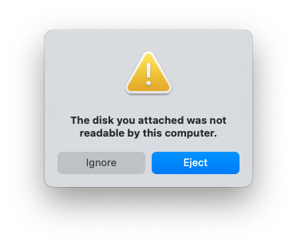
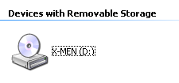
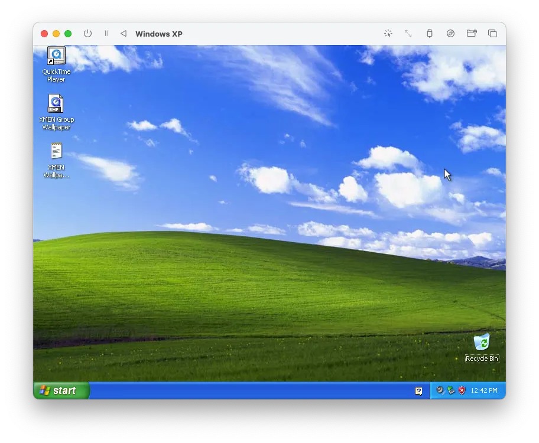
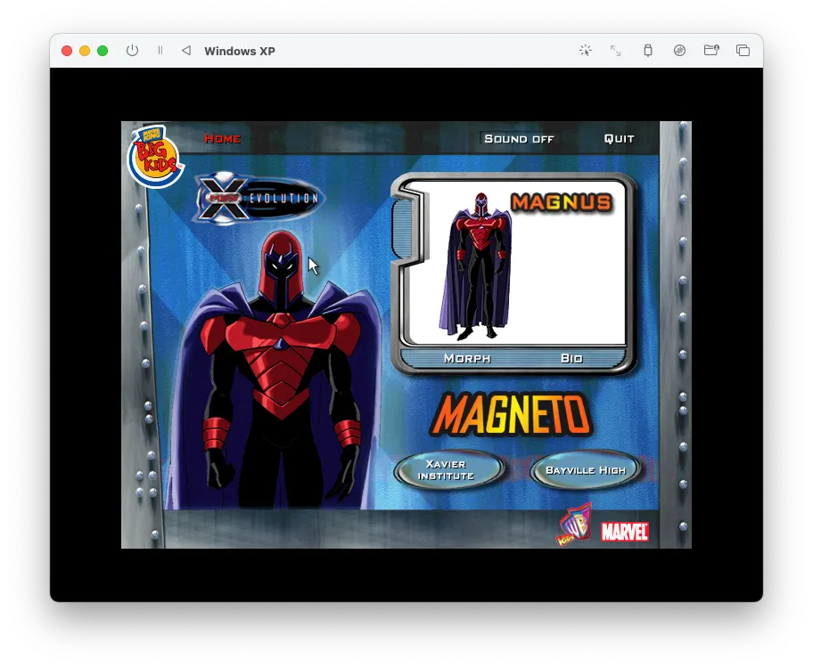

Remember the specific joy of a fast-food kid's meal? It wasn't just the nuggets; it was the plastic treasure inside. In 2001, Burger King leveled up: they partnered with X-Men to release promotional toys that came with a Mini CD-ROM.

My six-year-old self was mesmerized. I can still remember the "clunk" of dropping that disc into my family’s old Dell computer and being transported into a world of early 2000s graphics and MIDI action music. It became a core memory.

Fast forward twenty-five years. During a visit to my parents’ house in 2025, I unearthed this relic. Naively, I thought I could just pop it into my 2021 MacBook Pro and play. I was wrong. What followed was a week-long journey into digital forensics, reverse engineering, and real-time translation.

## The First Wall: The "Gatekeeper" (macOS Error)

When I inserted the disc, my Mac didn't show me Wolverine. It showed me a "Disk Not Readable" error.



*The gatekeeper: the actual "Disk Not Readable" alert—the inciting incident.*

The problem was **sector mismatch**. Modern computers expect data organized in clean, 2048-byte "standard" sectors. However, these promotional discs were authored in a raw MODE1/2352 format. They packed the game data alongside "junk" metadata—sync headers and error-correction codes—that modern macOS isn't programmed to ignore.

Because the "map" of the disc was shifted by those extra bytes, my Mac's internal gatekeeper assumed the disc was broken. To fix this, I had to bypass the operating system entirely. Using the terminal command `dd`, I performed a raw forensic dump:

```bash
sudo dd if=/dev/rdisk6 of=magneto_raw.bin bs=2352
```

This created a "digital twin" of the disc—junk and all. But I still couldn't run it. I had to become the "firmware" myself. Using a tool called `bchunk`, I manually performed the surgery that a 2001-era CD drive would have done automatically: I "peeled" the 2352-byte raw sectors down to a clean 2048-byte `.iso` image.

## The Second Wall: The Language Barrier

Even with a clean ISO, I hit the **architecture wall**.

- **The game:** Written in x86 (the "Latin" of 2001 Intel chips).
- **The Mac:** Speaks ARM64 (the "Modern English" of Apple Silicon).

My Mac could finally "see" the files, but it couldn't "read" the instructions. It was like giving a French book to a Japanese reader. The book is clear, but the reader doesn't understand the words.

## The Solution: The Time Capsule

To bridge this gap, I used UTM to spin up a Windows XP virtual machine. UTM acted as a real-time interpreter, translating the game’s legacy x86 code into a language my M-series chip could execute.

Inside this virtual "time capsule," I provided the game with its natural habitat: Windows XP, DirectX, and the long-forgotten QuickTime 5. I "mounted" my cleaned `.iso` into the virtual drive, and for the first time in a quarter-century, the game's autoplay window flickered to life.



*The VM recognizes the mounted image as a real disc—**X-MEN** on D:, not an anonymous volume.*



*The time capsule: Windows XP in its own window—Bliss, QuickTime, and the rescued disc’s files finally readable.*



*The payoff: the original interactive launcher alive again—Magneto’s screen, Big Kids branding, and early-2000s UI chrome inside UTM.*

## Results & Learnings

Achieving that "Level Clear" screen wasn't just about a game; it was about the pipeline. I learned that every "big" technical problem is just a series of small, solvable gaps in knowledge.

By poking into raw binary code and emulating long-dead hardware, I realized that digital preservation is a manual labor of love. We have to "lead" our modern machines back to the past because they’ve forgotten the old dialects.

In the end, I didn't just restore a toy; I proved that with the right tools, no core memory is ever truly unreadable.

## Related project

The companion **[X-Men Time Machine](/projects/xmen-time-machine/)** project page summarizes this preservation effort alongside the restoration story above. Run the disc in a VM (UTM / Windows XP) as described in this post; there is no in-browser emulator on the site.

<details class="forensic-details">
<summary class="forensic-details__summary">Digital Forensics: Under the Hood</summary>
<div class="forensic-details__inner">

<h3 class="forensic-details__h3">The "Smoking Gun" in the Hexdump</h3>

<p>Poking into the raw binary was like looking at a digital fossil. Around offsets <code>0x240</code> and <code>0x420</code>, the dump spells out <code>Apple_partition_map</code>, <code>Toast 4.1 Partition</code>, and <code>Apple_HFS</code>. Toast 4.1 was the disc-burning stack many Mac shops used in the late 90s and early 2000s—so this Windows-facing promo disc was almost certainly mastered on a Mac a quarter-century ago. The irony: a 2026 MacBook had to rescue a 2001 disc that was born on the same lineage, because modern macOS would not mount it without help.</p>

<pre><code>00000240  41 70 70 6c 65 5f 70 61  72 74 69 74 69 6f 6e 5f  |Apple_partition_|
00000250  6d 61 70 00 00 00 00 00  00 00 00 00 00 00 00 00  |map.............|
00000260  00 00 00 00 00 00 00 02  00 00 00 13 00 00 00 00  |................|
00000410  50 4d 00 00 00 00 00 02  00 00 e4 fc 00 03 1f fe  |PM..............|
00000420  54 6f 61 73 74 20 34 2e  31 20 50 61 72 74 69 74  |Toast 4.1 Partit|
00000430  69 6f 6e 00 00 00 00 00  00 00 00 00 00 00 00 00  |ion.............|
00000440  41 70 70 6c 65 5f 48 46  53 00 00 00 00 00 00 00  |Apple_HFS.......|
00000450  00 00 00 00 00 00 00 00  00 00 00 00 00 00 00 00  |................|</code></pre>

<h3 class="forensic-details__h3">The "DNA" of a Raw Sector</h3>

<p>The first line of the dump is the sync header: twelve bytes of <code>00</code> and <code>ff</code> that mark where a 2352-byte raw sector begins—the landmark the laser uses to stay aligned. Seeing it meant the <code>dd</code> capture really was raw MODE1/2352, before any peeling.</p>

<pre><code>00000000  00 ff ff ff ff ff ff ff  ff ff ff 00 00 02 00 01  |................|</code></pre>

<h3 class="forensic-details__h3">The "Surgery" Report (<code>bchunk</code>)</h3>

<p><code>bchunk</code>'s log is the receipt: track 1 is MODE1/2352, user data starts at byte 16 inside each sector, and the peeled payload is 2048 bytes per sector—about 135MB of actual bits for the game.</p>

<pre><code>Track  1: MODE1/2352    01 00:00:00 (startsect 0 ofs 0)
Writing tracks:
 1: magneto_fixed01.iso 
 mmc sectors 0->66006 (66007)
 mmc bytes 0->155248463 (155248464)
 sector data at 16, 2048 bytes per sector
 real data 135182336 bytes
 128/128  MB  [********************] 100 %</code></pre>

<h3 class="forensic-details__h3">The "Identity Crisis" (<code>diskutil</code>)</h3>

<p><code>diskutil list</code> explains why Finder felt blind: macOS happily maps the Apple_HFS slice (~105MB) but leaves the rest of the hybrid disc—the x86 payload—in the cold. <code>bchunk</code> recovered the full ~135MB; the gap is the Windows side macOS does not surface as files.</p>

<pre><code>/dev/disk4 (external, physical):
   #:                       TYPE NAME                    SIZE       IDENTIFIER
   0:        CD_partition_scheme                        *155.2 MB   disk4
   1:     Apple_partition_scheme                         135.2 MB   disk4s1
   2:        Apple_partition_map                         1.0 KB     disk4s1s1
   3:                  Apple_HFS                         104.9 MB   disk4s1s2</code></pre>

</div>
</details>

## Technical glossary (by layer)

### 💿 The media layer: physical to digital

- **Mini CD-ROM (80mm):** A smaller variant of the standard 120mm CD. These were popular for promotional "pocket" media in the early 2000s, typically holding around 180MB of data.
- **Sector:** The smallest unit of data on a disc. Physically, every CD sector is 2352 bytes, but most modern computers only want to see the "clean" data inside.
- **MODE1/2352 (raw sector):** A formatting style where the computer reads all 2352 bytes of the sector, including the "junk" (sync headers and error correction).
- **Standard data sector (2048):** The "peeled" version of a sector. By stripping away the 304 bytes of metadata (2352 − 2048 = 304), you get the clean data that modern operating systems expect.

### 📂 The forensic layer: files & formats

- **`.bin` (binary image):** A raw, bit-for-bit "digital twin" of a disc. It contains everything the laser saw, including the "junk" sectors that prevent the Mac from mounting it.
- **`.cue` (cue sheet):** A small text file that acts as a "map" for the `.bin` file. It tells software where tracks start and what format (like 2352) they use.
- **`.iso` (optical disc image):** The industry-standard "cleaned" disc image. Unlike a `.bin`, an `.iso` only contains the 2048-byte user data sectors, making it universally readable by modern Macs and virtual machines.

### 🏗️ The hardware layer: the language of chips

- **ISA (instruction set architecture):** The "vocabulary" of a processor. It defines the basic commands (like ADD or MOVE) that a chip is physically built to execute.
- **x86:** The legacy "language" used by Intel and AMD processors. This is what the X-Men games were written in back in 2001.
- **ARM64 (Apple Silicon):** The modern "language" used by your M-series Mac chip. It is faster and more efficient but cannot natively understand x86 "speech."

### 🛠️ The restoration layer: tools of the trade

- **`dd` (data duplicator):** A powerful command-line utility used to copy data at the "block level." It bypasses the Mac's "Disk Not Readable" error by reading the physical pits on the disc directly.
- **`bchunk` (BinChunker):** The "digital scalpel." It uses the `.cue` map to cut the 2352-byte sectors in a `.bin` file down to clean 2048-byte sectors for an `.iso`.
- **UTM / virtual machine:** A "time capsule" for software. It creates a virtualized computer (in this case, an Intel-based PC running Windows XP) that sits on top of your Mac and translates legacy code in real time.
- **Firmware:** The "muscle memory" inside a CD drive. In 2001, this chip did the "peeling" automatically; in 2026, you had to perform this task manually using software.
