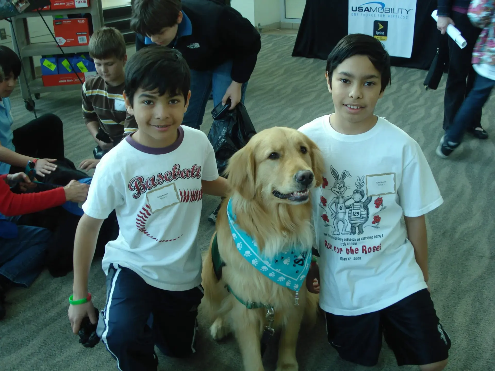
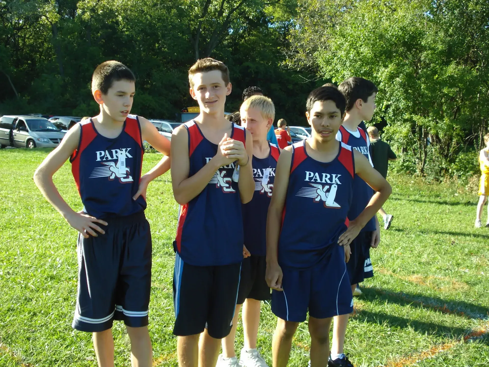
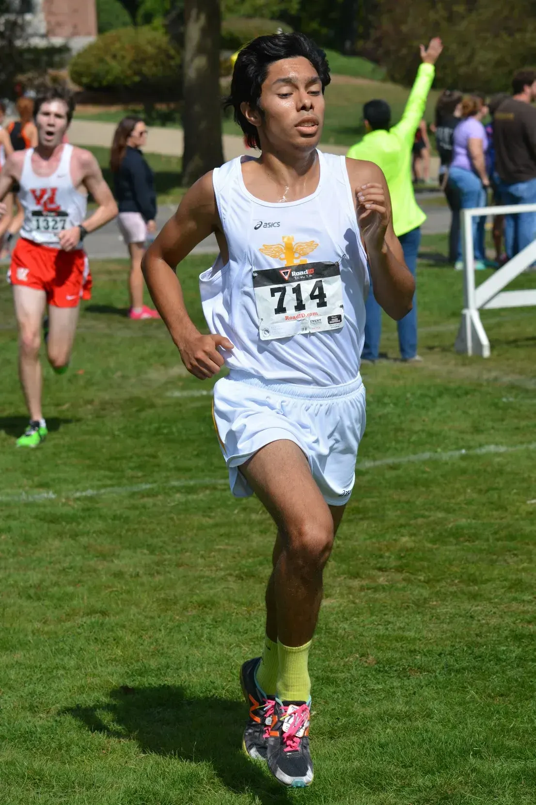
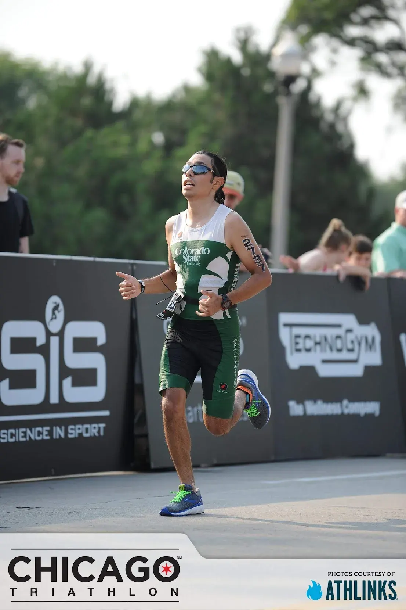
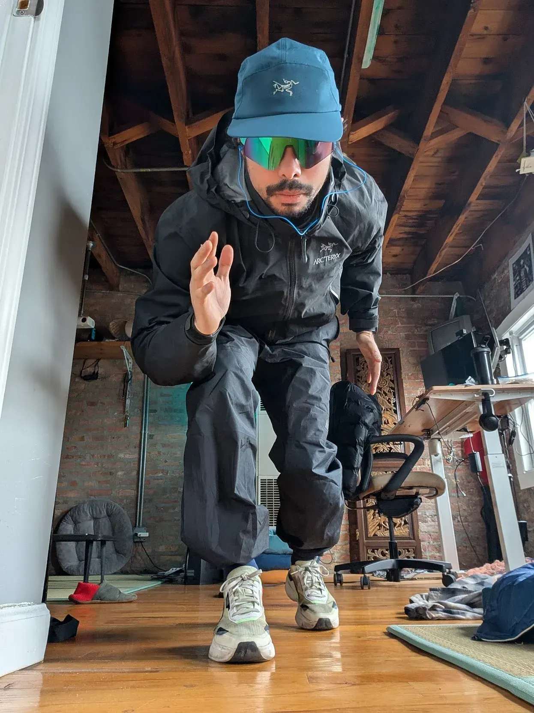

## Run for Fun

"Run for Fun" was my high school Cross Country team's *fun* motto.

Sort of ironic, but also somewhat serious, it was a perfect phrase to capture our team and goals.

However, this is not necessarily a reflection post on my high school running career. Instead, it's about *running for fun*.

### Elementary & Middle School Running 2008-2012

I can't remember what was the impetus for me running. It could have been my mom who had started to run local 5k races or my drive of competition. Whatever it was, I was running hard before any structured training when I was around 14 years old.

Wheather it was the straw run or pacer in elementary school, or the yearly 5k run, I wanted to run.

> 📋: **Note:** the straw run was a PE activity where each lap around the outdoor field, we would get a straw. There was an unsaid winner with the most staws. I wanted to be the one with the most straws.

> 📋: **Note:** the [pacer](https://en.wikipedia.org/wiki/Multi-stage_fitness_test) is multi-stage fitness test. Each level increases how fast you have to run back and forth in a gym. I wanted to be the last one standing. Oftentimes, it would be grueling to outrun my classmates and friends. Keep in mind, we did this in our regular clothes and then went straight to class afterwards 😂

*Run for roses 5k shirt*

Middle school running was where I got my offical start in strucuttred training and meets. Although I joind only in 8th grade, I quickly was one of the top runners and was invited to an invite only meet.

Perhaps the flame grew from here to race.

*My first meet at Nazerath in 8th grade*

This period was a time where I would want to sign up for 5k's. I was running for fun!

### High School Running 2013-2017

Obsessed with speed and winning, high school was a structured approach to running. From the top down, coaches and teammates were aligned on our mission: to win state (at least my senior year). That goal requires tough workouts.

*2015 me in Hisgschool*

*Example workout*
Tempo:

- 5x1mile laps around a park
- Each lap we progressively run faster
- Start at 6:20 min/mile, finish around 5:30 min/mile

This, in addition to speed work and hill training, made me into a fast runner. Even though I enjoyed it, maybe I enjoyed the team aspect more...

In high school, I was the fastest I've ever been. It was fun, but tough.

I was running to win.

### Collegiate Running 2017-2020

In college, I joined the triathlon team. As such, time had to be split between swimming, biking, and running. Coming off a relatively strong high school running career, I was a solid runner, but still not as fast as I was in high school.

*Chicago 2018 Triathlon*

I still did tempo runs and structured training to be the fastest triathlete I could be. However, being a triathlete takes hours. I would spend upwards to 20 hours a week training.

Over time, this was unsustainable and I burned myself out.

I would often restart tempo runs for a week or two, but eventually fell off and my running would be inconsistent.

With the Covid-19 pandemic taking over the world, I did have time to train, but this cycle of training quickly faded away.

I was running to... get back to what I was... but it wasn't happening.

### Adult Running 2020-2025

When I moved to Chicago, I restarted running, but it was still inconsistent. I wasn't really sure why I was training. This made me feel like, what's the point? I've always thought of myself as a runner, but at this point, I was not fast or fit.

This was a hard pill to swallow that lasted a number of years.

I would train for some time, then drop it, train again, and drop.

I had no goal or reason why I *should* run.

I was running to get back to my highschool runner self.

### Barefoot Running 2025-Present

My mom was interested in barefoot running about a decade ago. She bought two books:

1. [Barefoot Running](https://www.goodreads.com/book/show/8172776-barefoot-running?from_search=true&from_srp=true&qid=bUuAZnoP3M&rank=4)
2. [Why We Run](https://www.goodreads.com/book/show/19567944-why-we-run?from_search=true&from_srp=true&qid=rPhUgo0169&rank=1)

After a visit back home to my parents, I picked up both. Since then, I've finished Barefoot Running.

That has truly made me rethink running.

The premise of the book is that there are cultures that thrive on running. It's their form of transportation, fun, and way of life.

Developing makeshift running sandals out of recycled tires and string, they run as close to the ground as possible. They'll even run barefoot too!

The mind-blowing idea that has stayed with me after reading that book was this: they don't get injured.

I've been injured over the years and it seems to be because I force myself to run, not for fun, but to be fast. Pair this with the running shoe industry practically telling people that if they don't purchase their hundreds of dollars running shoes, they'll get injured.

Yet, the exact opposite is true. The more we as humans are away from the ground, the more injured we become.

Since then, I've begun running in more minimal shoes—[TOMS](https://www.toms.com) and even barefoot on grass.

Since the end of 2025, I've been running at least a mile a day—and I'm having fun doing it.

I've left behind the need for speed and replaced it with a need for fun.

### Now, where does this leave me today?

I'm happily running every day and sometimes more than a mile. In fact, my average daily mileage is roughly 3 miles a day!

Running, for me now, is more of just something I do every day. Just like how you brush your teeth, running is flossing for my body and mind.

*Me in my total techware fit for the rain*

I'm not sure how long I'll keep running, but for right now, I'm having fun doing it.

Now, i'm running for fun :)

Follow me on [strava](https://www.strava.com/athletes/24391901)
