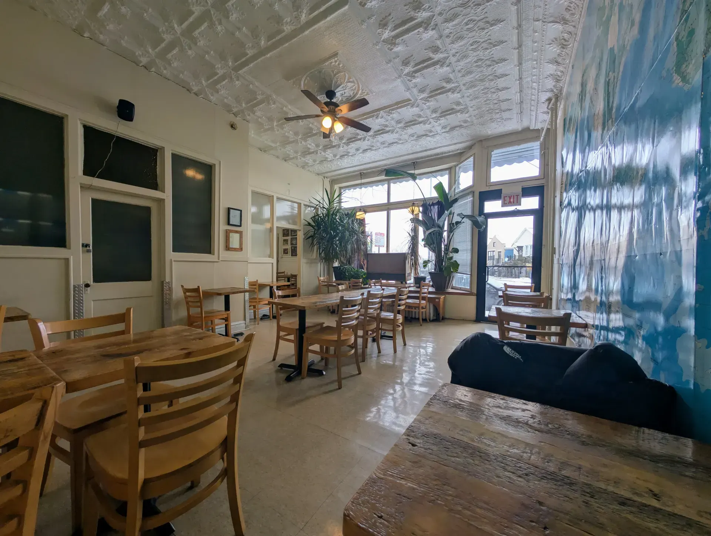
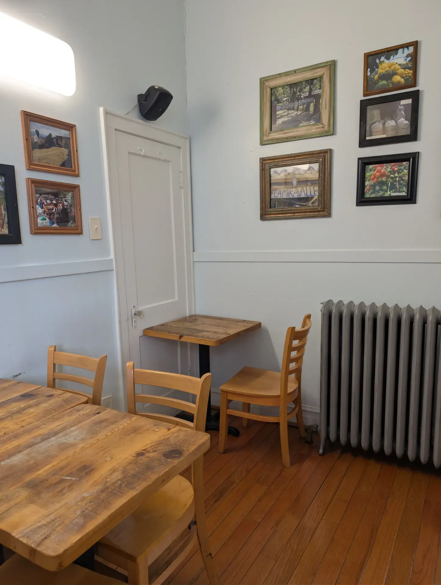
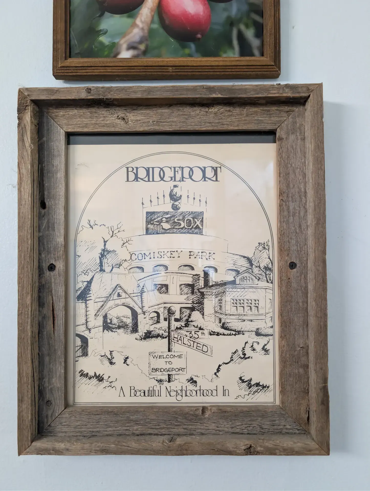

## Today: February 22nd, 2026

I am a person (a creature 🧌) of habit. My day to day does not change much. Right now, that's how I like it.

### Bridgeport Coffee House

I find myself questioning what coffee shop I will visit today. It's Sunday morning and I seem to have this internal debate in my mind of where to go. More often than not I find myself in Bridgeport.

Bridgeport Coffee House is my home for Saturday or Sunday morning. I used to not understand why, but now I do.

*View from my favorite spot in the map room*


Ambient recording from the map room.


#### Finding Bliss
After ordering a coffee, I make my way to the map room. The map room is a spacious room with maps from around the world and one massive world map 🗺️!

It's empty. The classical music station is playing. And the North facing windows flood the map room with overcast, snow reflected light.

Things feel right in this moment.

...

#### My Sunday Spotify playlist
Seated and ready to work, I pop on a very on-the-spot playlist: **My Sundays playlist**. This is a playlist of songs that have the word Sunday in them. I made other playlists for other days of the week too!



### Bridgeport

I enjoy Bridgeport.

It feels good to be at the border of the South and Lower West side of Chicago. After living up North for the past three years, this change of location is gratefully received.

### Something a little strange

Making my way from the counter of the coffee shop, I pass an interim room, a liminal passage space that transports the customer from the noisy and loud coffee shop experience to the map room where it immediately quiets down. 

Maybe this space between the two is that transitional space and thus the reason for this odd arrangement...

*White Sox Picture hangs in the transitory room*

Also in this room, I find a nod to the White Sox. Again... it feels good to be in Bridgeport.

*White Sox Picture hangs in the transitory room*

Over time, the once empty space fills. People come and go. Seats swap people. As much as I enjoy the solitude and bliss of an empty room, seeing people fill the space and feeling the map room become alive does some good for the soul. **I think I need that good soul healing**.