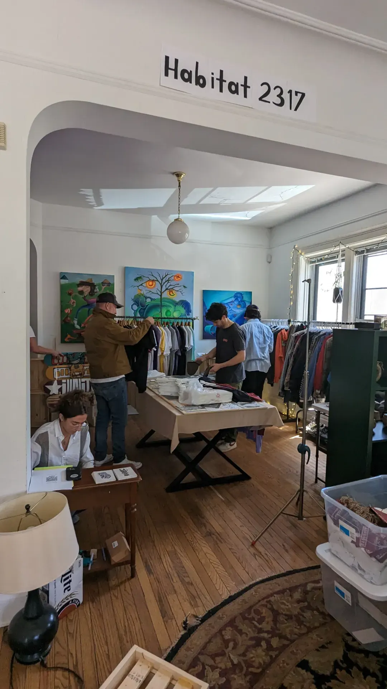
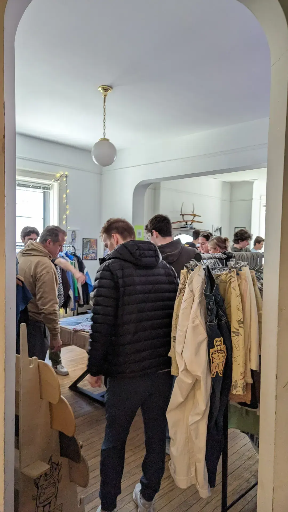

Transformations: Nice to See You Come, Nice to See You Go was the last art exhibition and
third show held at the event's original space at 2317 N. Orchard St, Chicago IL.

However, this is by no means the last one...

While it is a bitter-sweet moment to have held three art exhibitions at this location,
also know as my apartment, I have also recognized all of the memories that were created.

If nothing else, this was a may to say goodbye to Orchard.

## Exhibition Statement

When's the last time you experienced a bitter-sweet feeling?

Remember having no worries in the world as you ran wild in your parent's backyard,
transitioning from high school to college, or growing into yourself and leaving your old
self behind? These are powerful moments. They highlight what used to be and what came
after. This is important to reminisce on and is the thread that weaves this exhibition
together.

It is this essence, transitioning from one state to the next, that "Transformations: Nice
to See You Come, Nice to See You Go" aims to evoke as you experience the artworks. As you
encounter artworks from six Chicago-based artists whose styles range from abstract,
realism, and surrealism, consider the moments you feel as you leave one artwork behind and
approach the next. The abstract pieces capture the fluidity of change, the realistic works
bring tangible moments of transition to life, and the surrealistic art reflects the
dreamlike nature of memories.

Goodbyes are not always easy, but that means that when they are difficult, something
meaningful has happened. In the spirit of the exhibition's title, embrace the comings and
goings of life's chapters, acknowledging that it's not merely goodbye, it's nice to see
you come and nice to see you go.

## Pop-up

Habitat 2317 was thrilled to host an amazing selection of pop-up vendors at our event,
adding a secondary component to the all day experience.
[Ilality](https://www.instagram.com/illality/), a clothing brand co-owned by
<u>Jake Hollowed</u> and <u>Noah Denten</u>, brought their unique fashion sense to the crowd.
[Yagertings](https://www.instagram.com/yagertings/), owned by <u>Lucas Huneryager</u>,
showcased his vintage pieces. Additionally, <u>Beth Littman</u> of
[LiTT VINTAGE & SECONDHAND](https://www.instagram.com/littvintageandsecondhand/)
offered a fantastic range of clothing and accessories, some with a delightful twist.

*Pop-up vendors at the Transformations event.*

*Artwork display at the Transformations exhibition.*

Transformations: Nice to See You Come, Nice to See You Go" captured the
essence of transitions and personal growth through the diverse artworks of six
Chicago-based artists.
[Michelle Alexander](https://www.instagram.com/michelle.alexander.art/) explored the
internal build-up and trauma within the body.
[Jackie Patino](https://www.instagram.com/nakedgooseart) navigated religious trauma and
cultural identity.
[Ozzy Gamez](https://www.instagram.com/cactusvillain/) rediscovered personal meaning
through film photography, while
[Carinne Risch](https://www.instagram.com/carinnes_creations/) reflected historical
elements in contemporary pottery.
[Elijah Himes](https://www.instagram.com/p/C2vIR6-R7UC/) delved into surrealistic themes
with mixed media, and
[Tyler Morales](https://www.instagram.com/tyler_morales) explored personal transformation
and the intersection of art and technology. This exhibition invited viewers to reflect on
their own transitions and the bittersweet nature of change.
