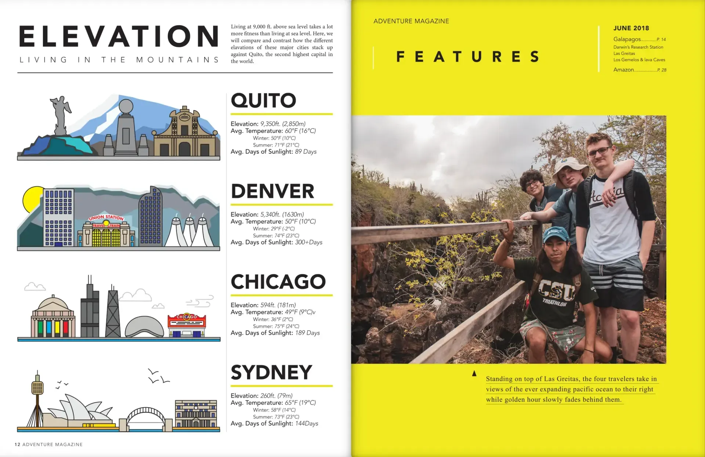
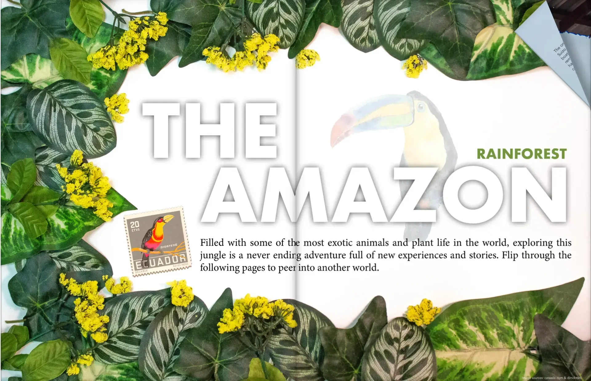

## First Proper International

Invited to stay with our friend, Nico Casalegno, at his parent's house, Grady Davis and myself almost immedietly say YES! Our other friend, Matt Schiltz joins us as we embark on our true first adventure out of the country. Some of us, not knowing where Ecuador was on the map, boldy heed the call of adventure. Before we know it, we have transported off American soil and have entered Quito.

*Infographic spread showing the elevation at different cities*

What follows is an adventure filled journey of road trips, almost getting into a fight in the Galapagos Islands, and many more terrefic stories.

It sure felt good seeing the Flordia shores and thinking, "we're back home".

*Physical collage with dollar store leaves and flowers combined with photoshop graphics*
