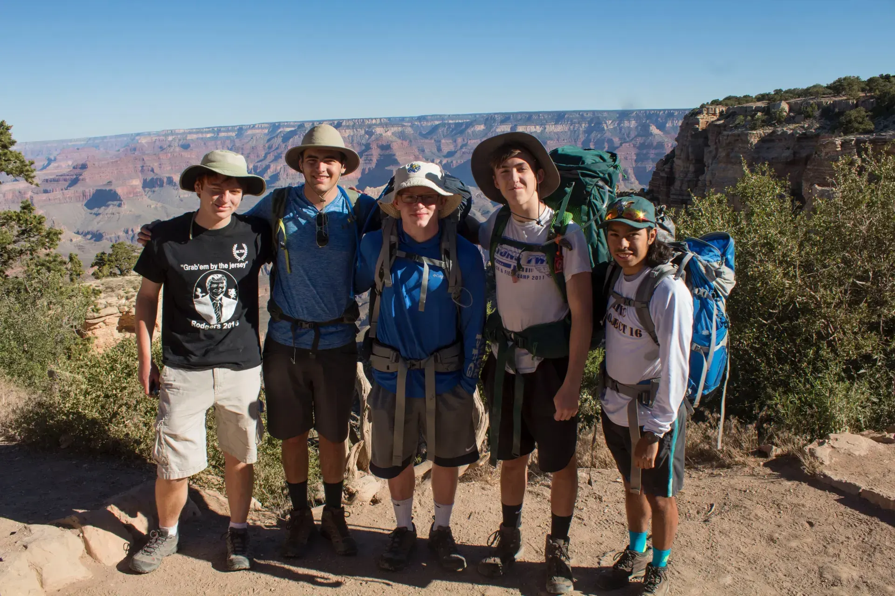
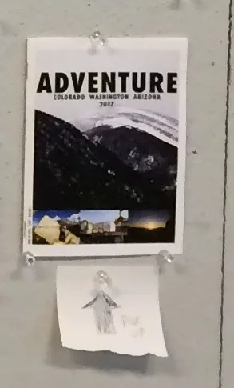

## The Road Trip Out West

Fresh out of highschool, the taste of freedom and adventure was sweet like honey on my tongue. Combine the brighter nights, multiple out of state trips, and enrolling in a photography class at the School of the Art Institue of Chicago, I was brimming with confidence and hunger for more. As fate would have it, the most mighty and hell-driven road trip I've ever experienced was right around the corner.

*The start of our 2 day hike down into the Grand Canyon and then back up.*

## The FIRST Adventure Magazine Issue

The photography class I took at SAIC the spring semester of my senior year of highschool queued me up perfectly to be prepared for this adventure. The class not only taught basic camera skills and software editing tools, but the final project was to create a Zine with photos each student had shot. I thought, what better use of my newly bought camera than to bring it along with my upcomming trips. That final product was what would evolve into Adventure Magazine.

*This was my final project Zine I made from photos I took from Arizona, Colorado, and Seattle.*

Feeling like a magazine at 33 pages, I was a surprised by that final product. While this first iteration seemed like my best quality work, I would later reflect and think, "what was this!"
