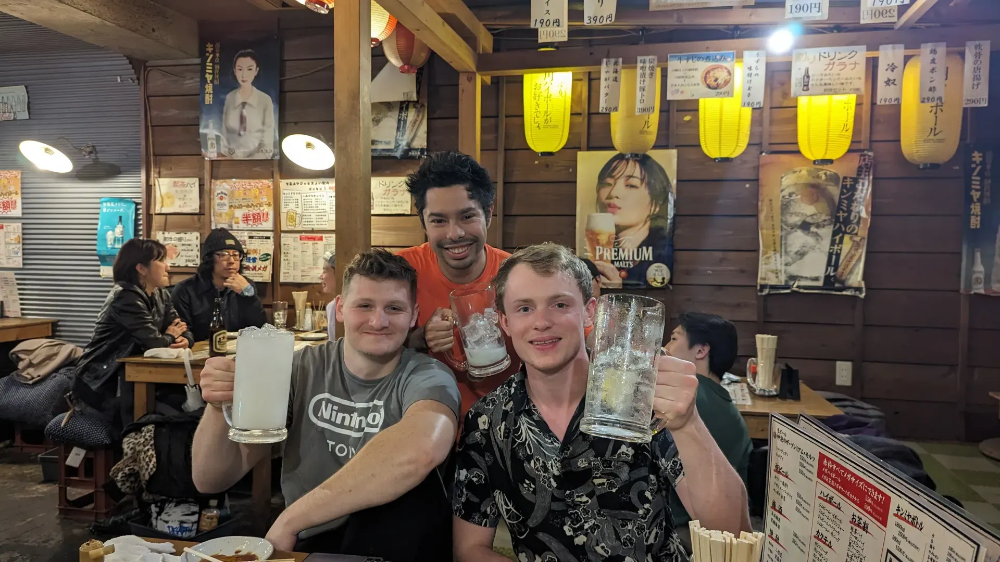
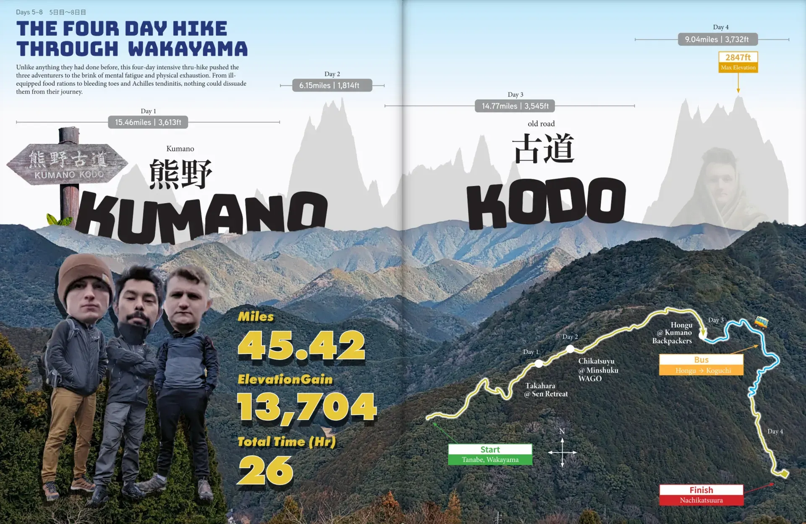
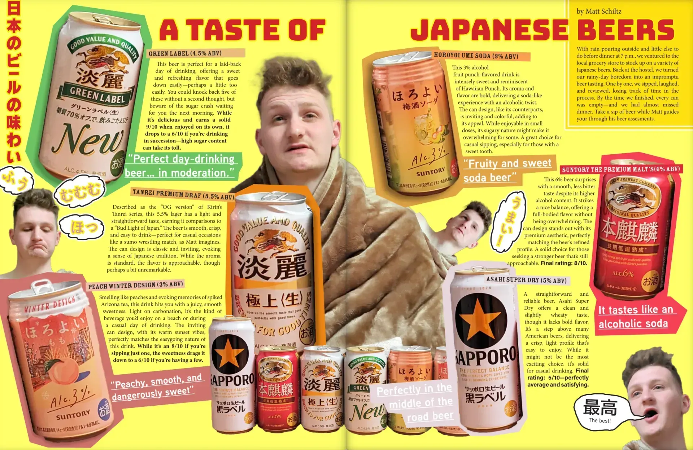
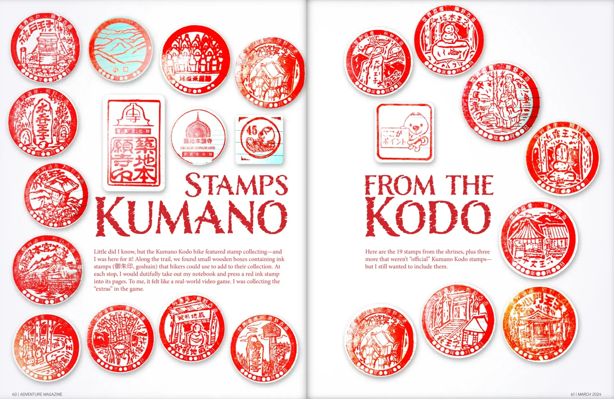
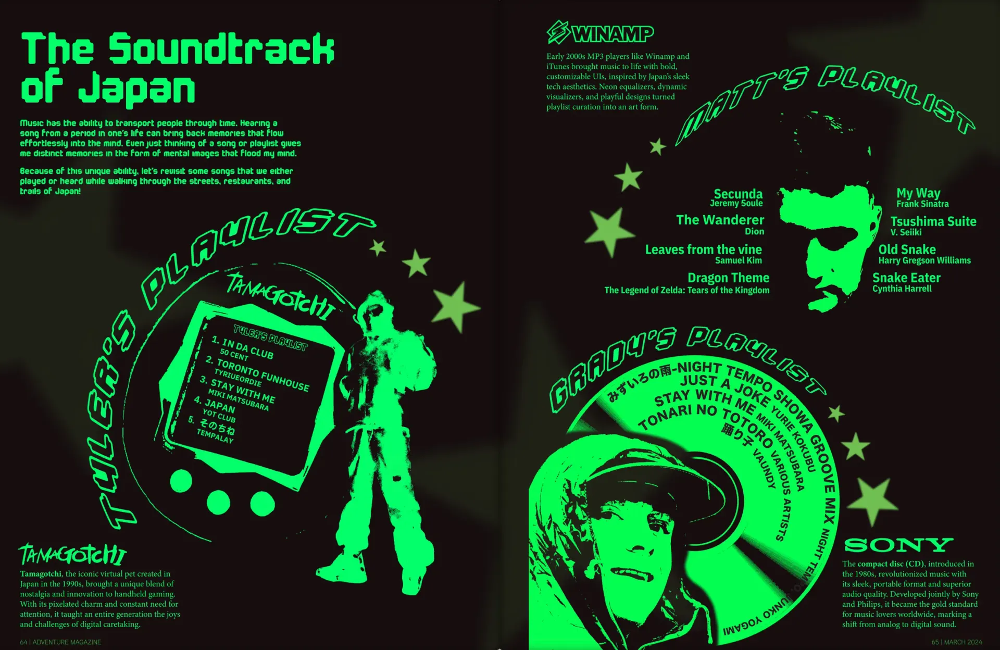

## Yea... I feel pretty good at this.

It was this issue of Adventure Magazine where I realized my gradual confidence in creating these. I knew at this point that my level of expectation for myself was higher than ever. I finally felt like I knew what I was doing with something.

I crafted my hyper-niche. Blending storytelling, documentation, and art, under the guise of adventure, I believe that what I have been able to produce is not only unique, but uniquely me. I truly must pour myself into each issue. For me, my next project must be better than the previous. I'm the sole judge of that. However, that does cause procrastination.

*One of our last nights in Tokyo celebrating with lemon sours.*

## Creating a team?

For this issue I decided to hire a Japanese editor to create a glossary of English to Japnanese translations. I also decided to hire a manga artist to depict a scene from our trip. I would love to have a team, but I don't really have a budget and maybe I just want to feel like i'm a real editor.

Yet, maybe the team is right besides you.

*Map showing the route we took on a 4 day through hike.*

*A spread showcasing the multiple types of beer we tried while waiting out the rain.*

*Along the way on our hike, I collected stamps inside little boxes along the trail.*

*Another spread going full designer mode makinig playlists of the songs we listened to.*
