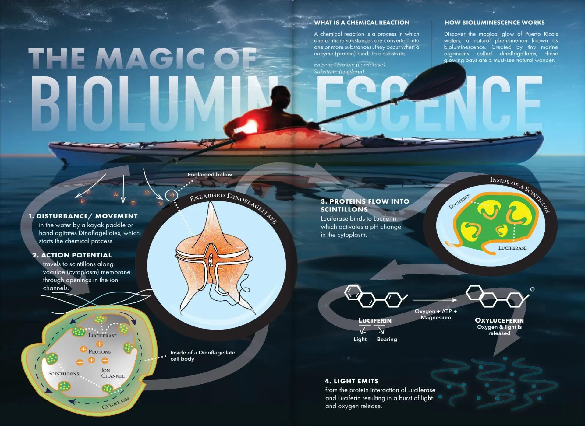
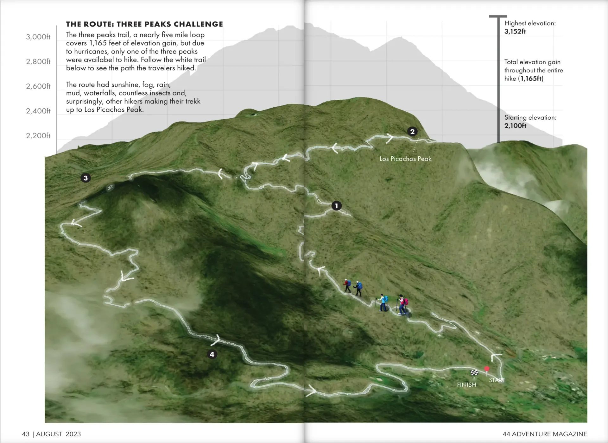
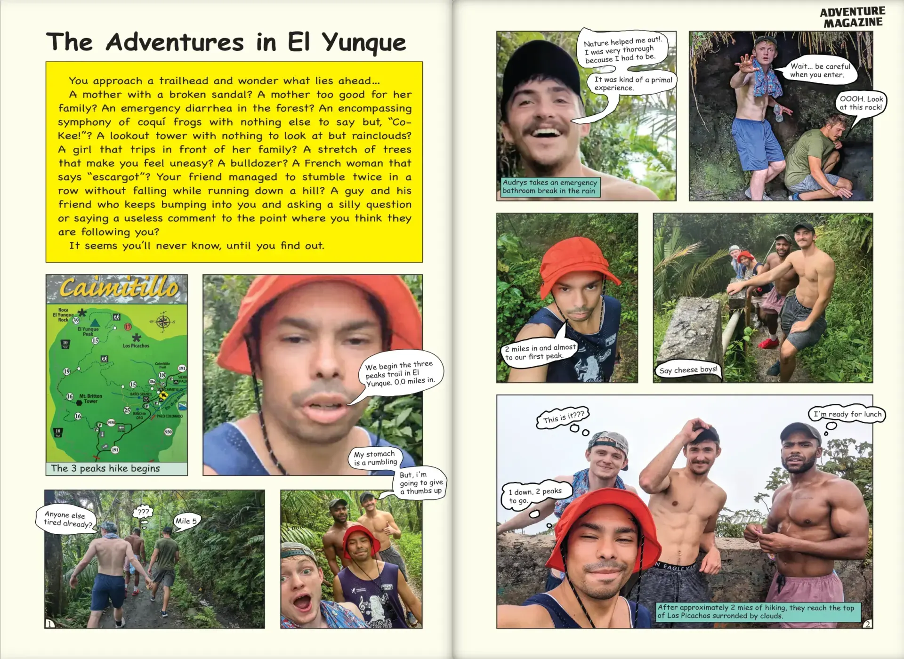

## Overview

Puerto Freak-o as some of us would like to call this trip. This mini-trip of 4 days waranted a mini magazine. This edition has been one of only two magazines that have been printed on half the size of regular copy paper.

*Infographic explaining how bioluminescence functions.*

This issue was a mini-issue. It was half the size of my full size 8.5x11 in. magazines, but it is no lesser of a magazine. In fact, it's one of my favorites for its experimental spreads I imagined.

*Spread highlighitng the hike we took through the rainforest.*

*Another spread showing a comic book layout experimental design.*
