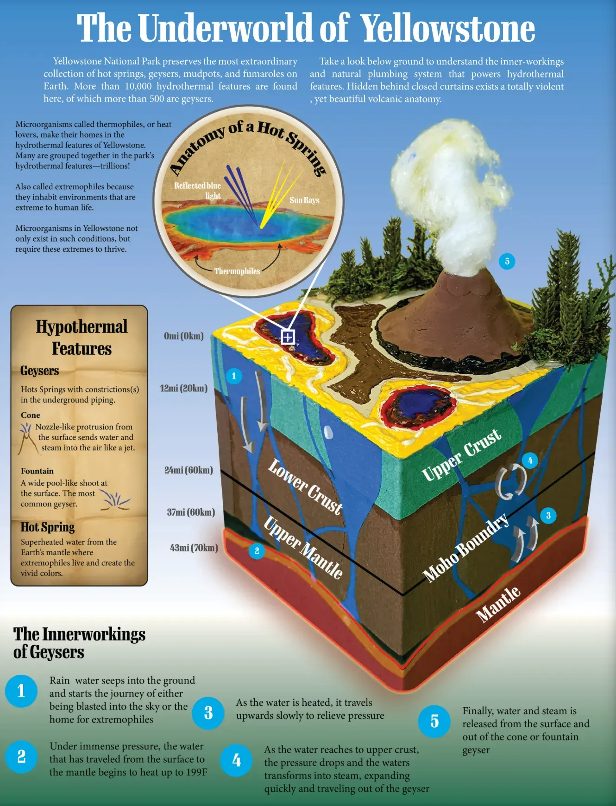

## Covid-19

In the midst of the 2020 Covid-19 pandemic, a group of my four friends gathered and set forth to Wyoming. While many people were inside issolating, we were driving hundreds of miles a day to explore nature without humans.

In a rare moment in time where nature could have a break from humans, we were first in line to enter back into Yellowstone.

*Diorama showing how geysers work. This was hand made from scratch with some Photoshop for cleanup.*
